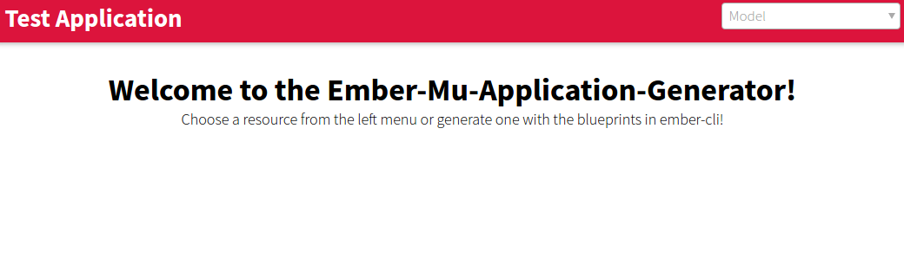
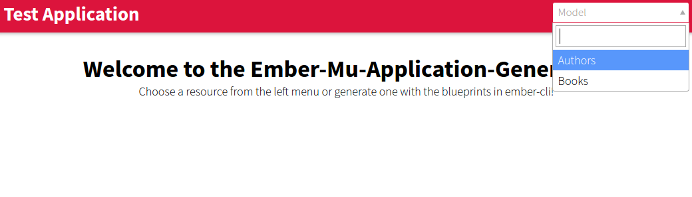
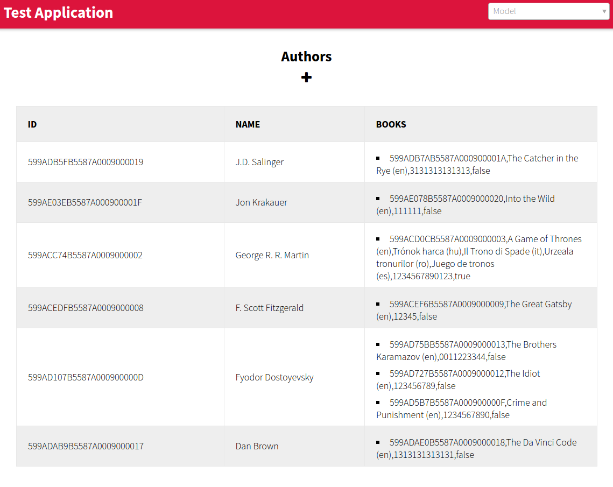
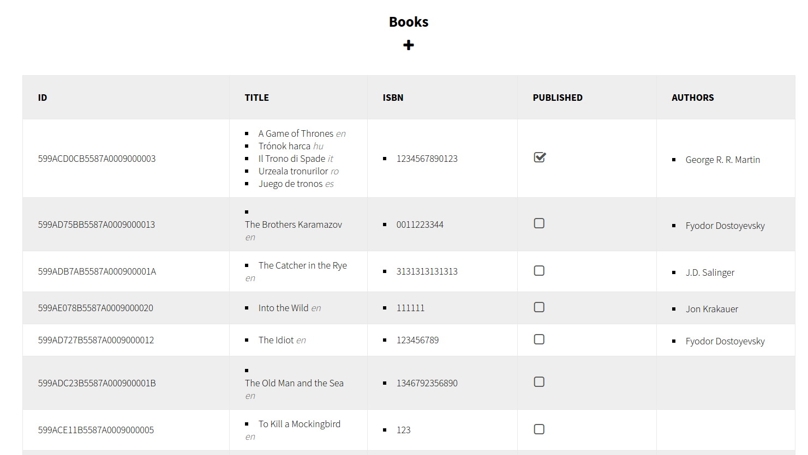
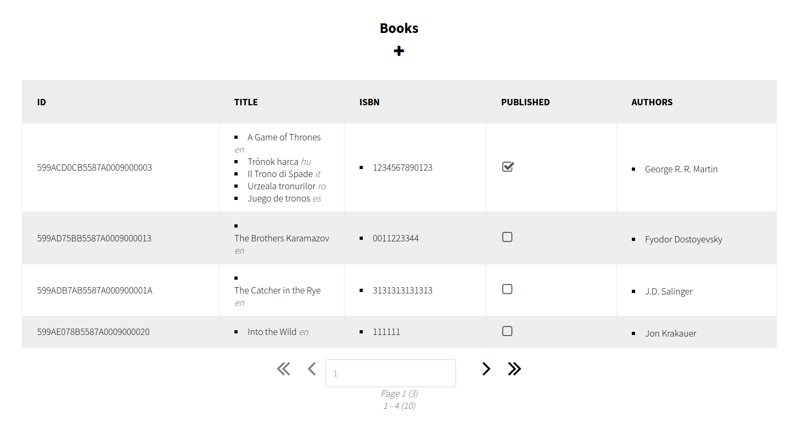
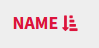
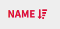
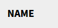
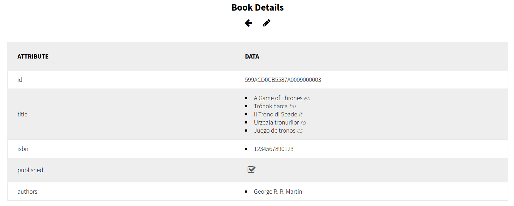

# Ember-mu-application-generator Application Usage

User manual for the application that is generated by the ember-mu-application-generator.

## Main Page
The main generated page of the application will use the crimson color on the navigation bar. The main page can contain a basic title and message, both are customizable through the mu-application-generator-welcome-page component.

The navigation bar contains the title of the application and a routing menu. Clicking on the title brings you back to the main page. Using the routing menu, you can switch between the different resources. Resources that have an index route will be shown. A search field is also available.

## Index Page

For each resource an index page is generated. It will give you a list of that resource in a table. Each column of a table is an attribute or relation for the resource type.

Available actions:
- Clicking on one row will bring you to the detailed view of that specific resources. See [show page](#show-page) for more information!
- The + button above the table gives you an option to create a new resource for this type. On ready-only applications, this button doesn't appear.

For the relation, by default it shows a string representation of the related item, what is a string version of all the attributes. You can change it to show only selected attributes. If you want to show the uri, mu-cl-resources will have to send back the uri.
Booleans are shown as checkboxes.

### Pagination

The table is paginated, the default value is 20. You can change the size in the router for each resource. Pagination controls have fast forwarding to the first and the last page, an option for go to a specified page and option to go to the next or previous page. If an option is not available, the button will be disabled.

There is a small text indicating the which page are you on right now and how many pages are there. And under it tells you which resources are you seeing now out of the number of available resources.

### Sorting

With clicking on a cell in the table header you can sort the table. The default sorting is ascending on ID. Triggering sorting on the ID is not possible. Descending sort on ID is not possible.

Possible actions:
- clicking on a not sorted field will end in an ascending sorting on that field.

  
- clicking on a sorted field:
  - from ascending sorting it will switch to descending sorting.

  
  - from descending sorting it will turn off sorting on that field. In this case, the table will be returned to the default sorting: ascending sorting on ID.

  

## Show Page

This page just shows all the attributes and relations of a single resource. The set items (like language-string-set, string-set, etc.) are indicated as a list, string, number or date is just a single label and booleans are checkboxes. Relations are links to that certain object.

Available actions:
- Go back (<-) to the list page of this resource type. See [index page](#index-page) for more information! Pay attention! If you go to another resource's page, this 'back' button will return you to the list page of the new resource, not to the previous page!
- Edit resource (pencil). Not available in read-only version.See [edit page](#edit-page) for more information!

## Edit Page
